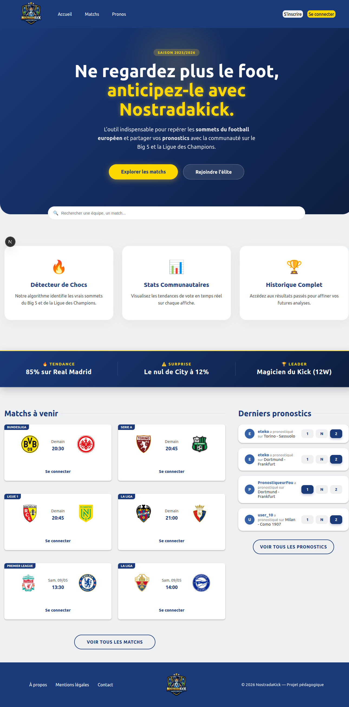

<div align="center">



# ⚽ NostradaKick

**Plateforme web de pronostics football**

*Pronostique les matchs des plus grandes compétitions européennes, suis tes statistiques et compare tes performances.*


[**🌐 Voir la démo live**](https://nostradakick.vercel.app) · [**📚 Documentation**](./docs/)

</div>

---

## 📖 À propos

**NostradaKick** est une application web de pronostics football, réalisée en **équipe de 4 personnes** sur 4 sprints (Scrum, du Sprint 0 de conception au Sprint 3) dans le cadre du projet de fin de cursus **Concepteur Développeur d'Applications** (RNCP 6, École O'clock).

Le projet permet aux utilisateurs de pronostiquer les résultats de matchs des plus grandes compétitions européennes (Ligue 1, Premier League, La Liga, Bundesliga, Serie A, Champions League), de suivre leurs statistiques (séries de victoires, ratio) et de comparer leurs performances.

> 💡 Ce repository est le **fork personnel** du projet original. Il a été nettoyé et republié pour servir de portfolio.

---

## ✨ Fonctionnalités

### 👤 Côté utilisateur
- **Inscription / connexion** sécurisée (Argon2 + JWT en cookies httpOnly)
- **Pronostiquer** les matchs à venir (victoire / nul / défaite)
- **Modifier** ses pronostics tant que le match n'a pas commencé
- **Dashboard personnel** : statistiques (séries de victoires, ratio) et historique
- **Filtrage** des matchs par compétition (6 ligues majeures)
- **Recherche** parmi les équipes et matchs

### 🛡️ Côté administrateur
- **Synchronisation** manuelle ou planifiée avec l'API football-data.org
- **Gestion** des matchs, utilisateurs et pronostics
- **Routes admin** dédiées et protégées par middleware

---

## 🛠️ Stack technique

### Frontend (`/client`)
- **Next.js 16** (App Router)
- **React 19**
- **TypeScript 5**
- **CSS Modules**

### Backend (`/api`)
- **Node.js 22** + **Express 5**
- **TypeScript 5**
- **Prisma ORM 7** (avec adapter PostgreSQL)
- **Zod** (validation des entrées)
- **Argon2** (hash de mots de passe)
- **JWT** (`jsonwebtoken`) avec cookies httpOnly + secure + sameSite
- **cron** (CronJob pour tâches planifiées)

### Base de données
- **PostgreSQL** (9 modèles, 9 migrations Prisma)

### API externe
- **football-data.org** (résultats et calendriers)

### Déploiement
- **Frontend** : Vercel
- **Backend** : Render
- **Base de données** : Neon (PostgreSQL serverless)

---

## 📂 Structure du projet

```
nostradakick/
├── api/                          # Backend Express (Node.js / TypeScript / Prisma)
│   ├── src/
│   │   ├── controllers/          # Logique des routes
│   │   ├── services/             # Logique métier (sync, userStat...)
│   │   ├── routers/              # Définition des routes
│   │   ├── middleware/           # requireAuth, requireAdmin
│   │   ├── validations/          # Schémas Zod
│   │   ├── jobs/                 # Cron jobs (sync football-data)
│   │   ├── config/               # Métadonnées des compétitions
│   │   ├── lib/                  # Prisma client, utils
│   │   └── app.ts                # Configuration Express
│   ├── prisma/
│   │   ├── schema.prisma         # Schéma de la BDD
│   │   ├── migrations/           # Migrations Prisma
│   │   ├── seed.ts               # Seeding initial
│   │   └── cleanMatches.ts       # Script de nettoyage des matchs
│   ├── tests/                    # Tests manuels (REST Client + SQL)
│   ├── config.ts                 # Variables d'environnement validées
│   ├── index.ts                  # Point d'entrée API
│   └── package.json
│
├── client/                       # Frontend Next.js (React / TypeScript)
│   ├── src/
│   │   ├── app/                  # Pages (App Router)
│   │   ├── components/           # Composants React
│   │   ├── context/              # AuthContext
│   │   ├── types/                # Types TypeScript partagés
│   │   ├── utils/                # Fonctions utilitaires (format, etc.)
│   │   ├── config/api.ts         # URL de l'API
│   │   └── proxy.ts              # Middleware Next.js (protection des routes)
│   ├── next.config.ts
│   └── package.json
│
└── docs/                         # Documentation de conception
    ├── 01-cahier-des-charges/
    ├── 02-conception/
    ├── 03-design/
    └── 04-audit/
```

---

## 🔐 Sécurité applicative

Le projet intègre plusieurs mesures de sécurité applicative :

| Mesure | Implémentation |
|---|---|
| **Hash des mots de passe** | Argon2 (algorithme recommandé OWASP) |
| **Authentification** | JWT signé + refresh token opaque (rotation à chaque refresh), stockés en cookies httpOnly + secure + sameSite |
| **Cross-domain** | Configuration CORS avec multi-origines (Vercel ↔ Render) |
| **Validation des entrées** | Zod sur toutes les routes API (body, query, params) |
| **Protection des routes** | Middlewares `requireAuth` / `requireAdmin` (backend) + `proxy.ts` (frontend Next.js) |
| **Injection SQL** | Requêtes paramétrées via Prisma ORM |
| **Variables sensibles** | Validation au démarrage via `getEnv()` (échec rapide si manquantes) |


---

## 🚀 Installation & lancement

### Prérequis

- **Node.js 22+** (voir `.nvmrc` dans `/api`)
- **PostgreSQL** installé localement (ou accès à une BDD distante)
- **npm** ou **pnpm**
- Une clé API gratuite **[football-data.org](https://www.football-data.org/)**

### 1. Cloner le repo

```bash
git clone https://github.com/Oktay-Albayrak/nostradakick.git
cd nostradakick
```

### 2. Configuration du Backend (`/api`)

```bash
cd api

# Installation des dépendances
npm install

# Configurer les variables d'environnement
cp .env.example .env
# Puis éditer .env avec vos valeurs

# Générer le client Prisma
npm run db:generate

# Appliquer les migrations à la BDD
npm run db:migrate:dev

# (Optionnel) Remplir la BDD avec des données de seed
npm run db:seed

# (Optionnel) Synchroniser une première fois les données football-data
npm run sync

# Lancer le serveur en mode dev (port 4000 par défaut)
npm run dev
```

### 3. Configuration du Frontend (`/client`)

Dans un **nouveau terminal** :

```bash
cd client

# Installation des dépendances
npm install

# Configurer les variables d'environnement
cp .env.example .env

# Lancer le serveur de développement (port 3000 par défaut)
npm run dev
```

### 4. Accéder à l'application

- **Frontend** : http://localhost:3000
- **API** : http://localhost:4000

---

## 🔧 Variables d'environnement

Les variables nécessaires sont décrites dans les fichiers `.env.example` :

- [`api/.env.example`](./api/.env.example) — Configuration du backend (port, BDD, JWT, API football-data, CORS)
- [`client/.env.example`](./client/.env.example) — Configuration du frontend (URL de l'API)

---

## ⚙️ Scripts disponibles

### Backend (`/api`)

| Commande | Description |
|---|---|
| `npm run dev` | Lance l'API en mode dev (watch mode) |
| `npm run build` | Génère le client Prisma (pour la prod) |
| `npm start` | Lance l'API en mode production |
| `npm run db:generate` | Génère le client Prisma |
| `npm run db:migrate:dev` | Applique les migrations en dev |
| `npm run db:migrate:deploy` | Applique les migrations en prod |
| `npm run db:seed` | Remplit la BDD avec des données de seed |
| `npm run db:reset` | Reset complet de la BDD (migration + seed) |
| `npm run db:studio` | Ouvre Prisma Studio |
| `npm run sync` | Synchronise manuellement les données football-data |
| `npm run lint` | Lance ESLint |

### Frontend (`/client`)

| Commande | Description |
|---|---|
| `npm run dev` | Lance Next.js en mode dev |
| `npm run build` | Build de production |
| `npm start` | Lance le build en mode production |
| `npm run lint` | Lance ESLint |

---

## 🧠 Défis techniques résolus

### 1. Configuration CORS multi-environnements

**Problème** : à l'origine, les URLs autorisées par CORS étaient codées en dur dans le code source, ce qui empêchait toute flexibilité (changement de domaine, ajout de previews Vercel) et exposait des informations de configuration.

**Solution** : migration vers une configuration **basée sur variables d'environnement** (`ALLOWED_ORIGIN`), avec support de **plusieurs origines** séparées par virgule, parsées et validées au démarrage de l'application.

### 2. Cross-domain en production (cookies JWT)

**Problème** : le déploiement front (Vercel) et back (Render) sur **deux domaines différents** posait un problème de transmission des cookies JWT (httpOnly) entre les domaines, empêchant l'authentification.

**Solution** : configuration des cookies avec `sameSite: "none"` + `secure: true`, combinée à la configuration CORS multi-origines avec `credentials: true`.

### 3. Calcul idempotent des statistiques utilisateur

**Problème** : recalculer les statistiques utilisateur (séries de victoires, nombre de wins/losses) à chaque finalisation de match risquait de créer des incohérences ou des doublons en cas d'exécution répétée du processus de synchronisation.

**Solution** : implémentation du service `userStat.service.ts` en mode **idempotent**, calculant `wins_count`, `losses_count`, `best_streak` et `current_streak` de manière déterministe à partir de l'historique complet des prédictions de l'utilisateur.

---

## 👥 Équipe

Projet réalisé en équipe de 4 développeurs dans le cadre de la formation CDA O'clock :

| Nom | Rôle |
|---|---|
| **Oktay** | Lead Back-end, Fullstack |
| **Benjamin** | Lead Front-end, Fullstack |
| **Hakim** | Product Owner, Fullstack |
| **Willanh** | Git Master, Fullstack |

---

## 📚 Documentation

La documentation complète du projet est disponible dans le dossier [`docs/`](./docs/) :

- **Cahier des charges** ([`docs/01-cahier-des-charges/`](./docs/01-cahier-des-charges/))
- **Conception** ([`docs/02-conception/`](./docs/02-conception/)) : MCD, MLD, ERD, diagrammes de séquence, architecture
- **Design** ([`docs/03-design/`](./docs/03-design/)) : maquettes, wireframes, charte graphique, screenshots
- **Audit** ([`docs/04-audit/`](./docs/04-audit/)) : écarts entre conception initiale (Sprint 0) et réalisation finale

📄 Le dossier complet du projet CDA est également disponible en PDF : [`docs/dossier-projet-cda.pdf`](./docs/dossier-projet-cda.pdf)

---

## 📝 License

Projet réalisé dans le cadre de la certification CDA Niveau 6 (RNCP 6).

---

<div align="center">

**Réalisé pendant la formation CDA — École O'clock**

🔗 [LinkedIn](https://www.linkedin.com/in/oktay-albayrak-862b40285/)

</div>